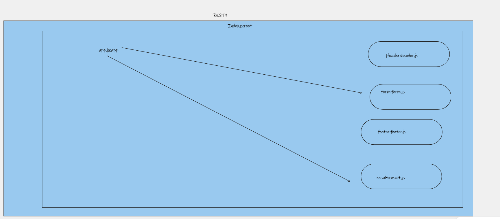
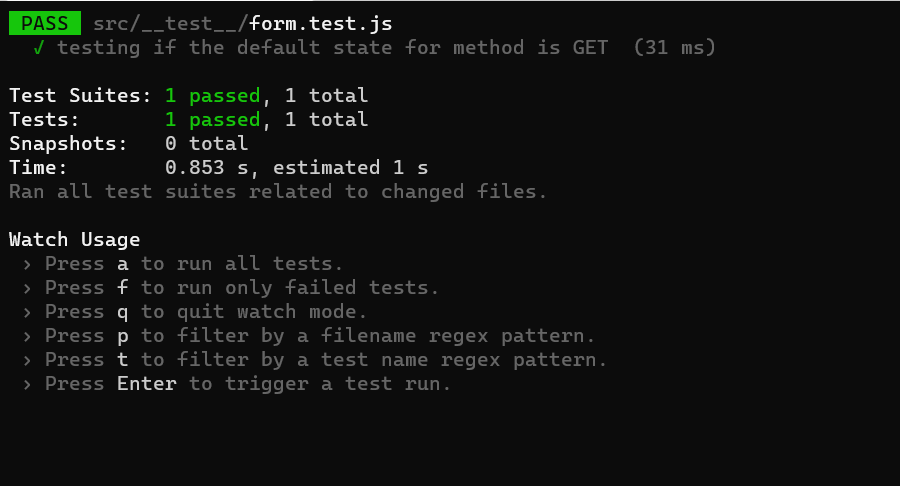

# RESTy

## UML 

## Test

## LINKS: 
[pull Requests](https://github.com/shamssar/resty/pull/4)

[Action](https://github.com/shamssar/resty/actions)

[gh-pages](https://shamssar.github.io/resty/) 

[resty](https://voluble-blini-ccf9a6.netlify.app/)
